# AASTU-Food Delivery Aggregator System-G2

**Distributed Systems Mini Project – Addis Ababa Science and Technology University (AASTU)**

---

## Overview

The **Food Delivery Aggregator System** is a **microservices-based platform** connecting **customers, restaurants, and delivery agents**. It supports food ordering, payments, and efficient delivery tracking using **Nestjs**, and an **event-driven architecture** with **RabbitMQ**.

The project demonstrates key **distributed system concepts**: service independence, asynchronous communication, eventual consistency, and scalability.

---

## Architecture

**Core Microservices:**

| Service             | Purpose                                                 |
| ------------------- | ------------------------------------------------------- |
| **Auth Service**    | User registration, login, and role-based access control |
| **Order Service**   | Manages orders, tracks status, and publishes events     |
| **Payment Service** | Processes payments and publishes confirmation events    |
| **Notification Service** | Consumes domain events and delivers system notifications |
| **Frontend Service** | Shows a working UI that shows all the process |


### Architecture Sketch


**Supporting Components:**

* **API Gateway:** Routes requests to services
* **Message Broker (Rabbit-MQ):** Handles asynchronous communication
* **Databases:** Each service has its own PostgreSQL database
* **Redis:** Caching frequently accessed data

---

## Technologies

Nestjs, PostgreSQL, Redis, RabbitMQ, Docker, JWT, Nginx/Nestjs Gateway

---

## Team

* **Miraf Debebe**
* **Mistire Daniel (Team Lead)**
* **Nasifay Chala**
* **Natan Addis**
* **Nathnael Keleme**
* **Rediet Birhanu**


# Food Delivery Aggregator - Comprehensive Architecture Deep Dive

This document provides an exhaustive technical analysis of the microservices architecture, covering service communication, authentication, real-time notifications, database design, security patterns, resilience strategies, and infrastructure.

---

## Table of Contents

1.  [System Overview](#1-system-overview)
2.  [How Services Communicate With Each Other](#2-how-services-communicate-with-each-other)
3.  [How the API Gateway Validates Tokens](#3-how-the-api-gateway-validates-tokens)
4.  [Complete Authentication Flow](#4-complete-authentication-flow)
5.  [How the Notification Service Handles Events](#5-how-the-notification-service-handles-events)
6.  [Why and How Socket.io is Used](#6-why-and-how-socketio-is-used)
7.  [Why RabbitMQ Queues from Auth-Service Appear Empty](#7-why-rabbitmq-queues-from-auth-service-appear-empty)
8.  [Database Architecture (Database-per-Service)](#8-database-architecture-database-per-service)
9.  [Security Patterns](#9-security-patterns)
10. [Resilience Patterns](#10-resilience-patterns)
11. [Frontend API Client with Transparent Token Refresh](#11-frontend-api-client-with-transparent-token-refresh)
12. [Infrastructure Overview](#12-infrastructure-overview)
13. [Complete Message Flow Diagrams](#13-complete-message-flow-diagrams)

---

## 1. System Overview

The Food Delivery Aggregator is a microservices-based platform consisting of:

| Service               | Technology         | Port  | Purpose                                    |
|-----------------------|--------------------|-------|--------------------------------------------|
| `frontend`            | Next.js (React)    | 3000  | Customer, Restaurant, Driver, Admin UIs    |
| `api-nginx`           | Nginx              | 8080  | Reverse proxy, request routing             |
| `api-gateway`         | NestJS             | 4001  | Swagger aggregation (optional auth)        |
| `auth-service`        | NestJS + Prisma    | 4000  | User registration, login, JWT, email       |
| `order-service`       | Express + Prisma   | 4002  | Restaurants, items, orders, delivery       |
| `payment-service`     | Express + Prisma   | 4003  | Stripe/Chapa payments, webhooks            |
| `notification-service`| NestJS + TypeORM   | 4004  | Event consumption, WebSocket push          |

**Supporting Infrastructure:**
-   **RabbitMQ**: Message broker for async communication
-   **Redis**: Caching/session storage (used by payment-service)
-   **PostgreSQL**: 4 separate database instances (one per service)
-   **MailHog**: Development SMTP server for email testing

---

## 2. How Services Communicate With Each Other

The system uses a **hybrid communication model** combining synchronous HTTP requests with asynchronous messaging via RabbitMQ.

### 2.1 Synchronous Communication (HTTP via Nginx)

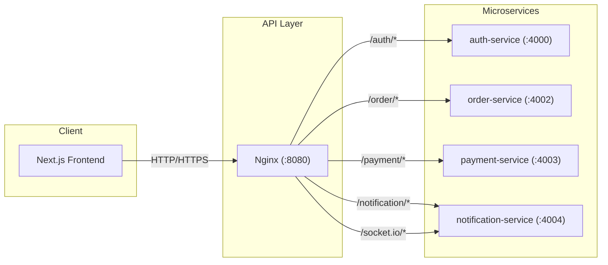

**How Nginx Routes Requests:**

Nginx uses location-based routing to direct requests to the appropriate backend service. Each service has its own path prefix.

```nginx
# From nginx.conf

location /auth/ {
    proxy_pass http://auth_service;
    proxy_set_header Host $host;
    proxy_set_header X-Real-IP $remote_addr;
}

location /order/ {
    proxy_pass http://order_service;
    # ... headers
}

location /payment/ {
    rewrite ^/payment/?(.*)$ /$1 break;  # Strips /payment prefix
    proxy_pass http://payment_service;
}

location /socket.io/ {
    proxy_pass http://notification_service;
    proxy_http_version 1.1;
    proxy_set_header Upgrade $http_upgrade;
    proxy_set_header Connection "upgrade";  # WebSocket upgrade
}
```

> [!IMPORTANT]
> **CORS Handling**: Nginx handles OPTIONS preflight requests directly, adding the necessary `Access-Control-*` headers. For actual requests, the backend services handle CORS via `app.enableCors()`.

**Key File:** [nginx.conf](file:///home/mistire/Projects/class-projects/food-delivery-aggregator/api-gateway/nginx/nginx.conf)

---

### 2.2 Asynchronous Communication (RabbitMQ)

For decoupled, event-driven communication, services publish and consume messages through **RabbitMQ**.

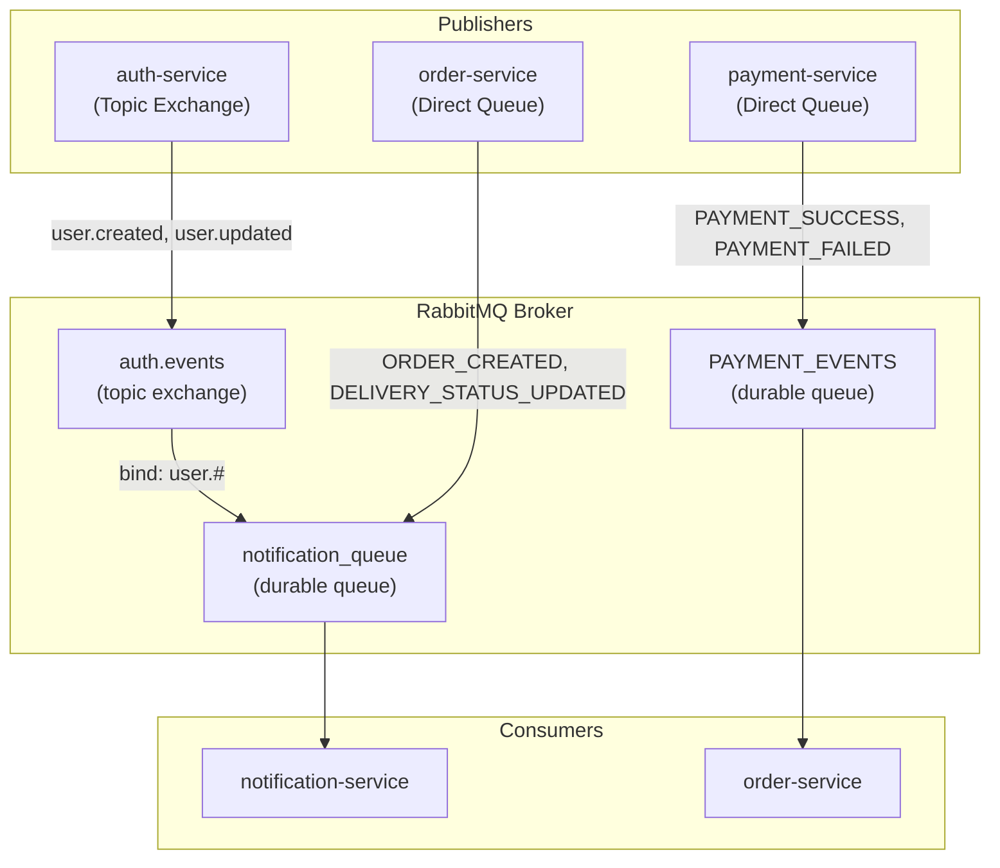

**Two Messaging Patterns:**

| Pattern            | Used By           | How It Works                                                                 |
|--------------------|-------------------|------------------------------------------------------------------------------|
| **Topic Exchange** | `auth-service`    | Publishes to `auth.events` exchange with routing keys like `user.created`. Consumers bind with wildcard patterns (`user.#`). |
| **Direct Queue**   | `order-service`, `payment-service` | Publishes directly to a named queue (`notification_queue`, `PAYMENT_EVENTS`). |

**Why Topic Exchange for Auth?**
-   Supports **multiple consumers** with different binding patterns
-   Future services can subscribe to specific user events (e.g., `user.role.updated`) without modifying the publisher

**Why Direct Queue for Orders/Payments?**
-   Simple point-to-point messaging
-   Each message is consumed by exactly one consumer
-   Guaranteed ordering within the queue

**Key Files:**
-   Auth Publisher: [rabbitmq.service.ts](file:///home/mistire/Projects/class-projects/food-delivery-aggregator/auth-service/src/rabbitmq/rabbitmq.service.ts)
-   Order Publisher: [order.service.js](file:///home/mistire/Projects/class-projects/food-delivery-aggregator/order-service/src/core/services/order.service.js)
-   Payment Publisher: [paymentController.js](file:///home/mistire/Projects/class-projects/food-delivery-aggregator/payment-service/src/controllers/paymentController.js)

---

## 3. How the API Gateway Validates Tokens

Token validation is **decentralized**. Each service that needs authentication includes the JWT validation logic and uses the **same shared secret**.

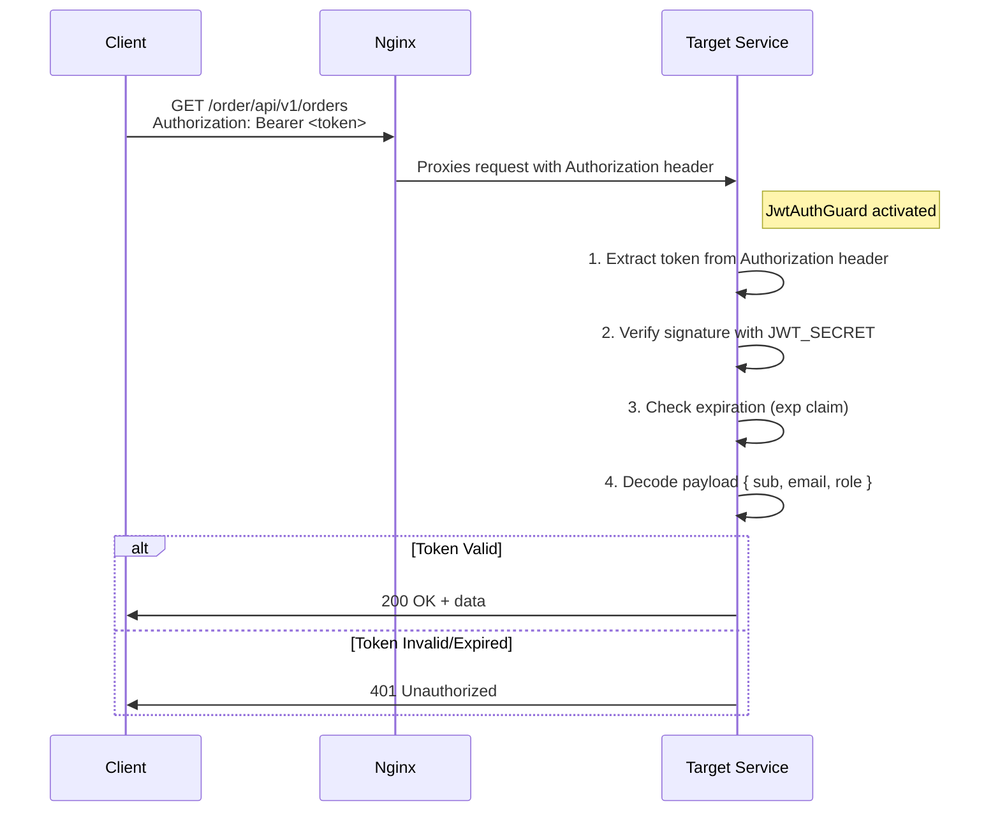

### 3.1 JWT Strategy Implementation

```typescript
// api-gateway/src/auth/jwt.strategy.ts

@Injectable()
export class JwtStrategy extends PassportStrategy(Strategy) {
  constructor() {
    super({
      jwtFromRequest: ExtractJwt.fromAuthHeaderAsBearerToken(),
      secretOrKey: process.env.JWT_SECRET!,  // SHARED SECRET
    });
  }

  async validate(payload: any) {
    // Attach user info to request object
    return { userId: payload.sub, username: payload.username, role: payload.role };
  }
}
```

### 3.2 Token Properties

| Property          | Value           | Purpose                                    |
|-------------------|-----------------|--------------------------------------------|
| Access Token TTL  | 15 minutes      | Short-lived for security                   |
| Refresh Token TTL | 7 days          | Long-lived for seamless re-authentication |
| Algorithm         | HS256 (default) | Symmetric signing with shared secret       |
| Storage           | localStorage    | Frontend stores tokens                     |

> [!WARNING]
> **Security Note**: All services that validate tokens MUST have the same `JWT_SECRET`. If this secret is compromised, all tokens become invalid. Consider rotating secrets periodically and using a secrets manager in production.

**Key Files:**
-   [jwt.strategy.ts](file:///home/mistire/Projects/class-projects/food-delivery-aggregator/api-gateway/src/auth/jwt.strategy.ts)
-   [auth.guard.ts](file:///home/mistire/Projects/class-projects/food-delivery-aggregator/api-gateway/src/auth/auth.guard.ts)

---

## 4. Complete Authentication Flow

### 4.1 User Registration Flow

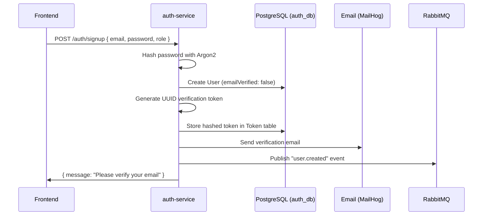

### 4.2 Email Verification Flow

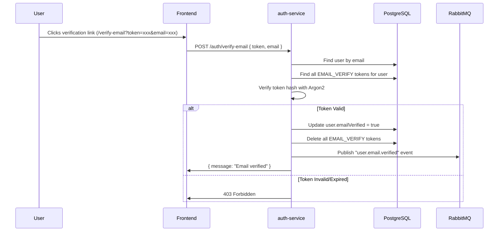

### 4.3 Login Flow with Token Generation

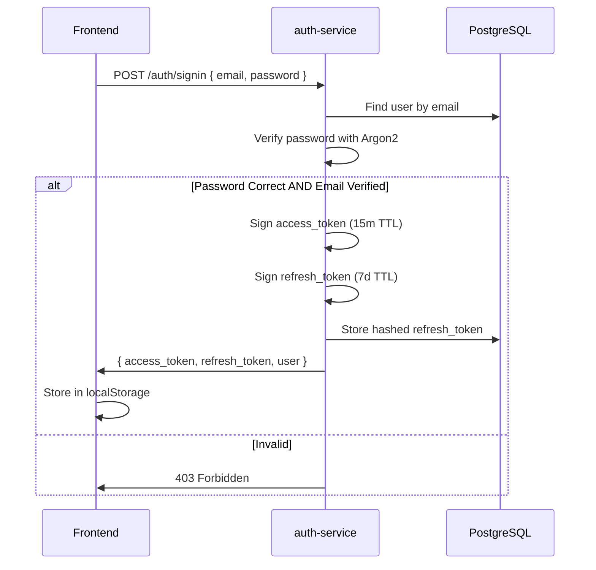

### 4.4 Password Reset Flow

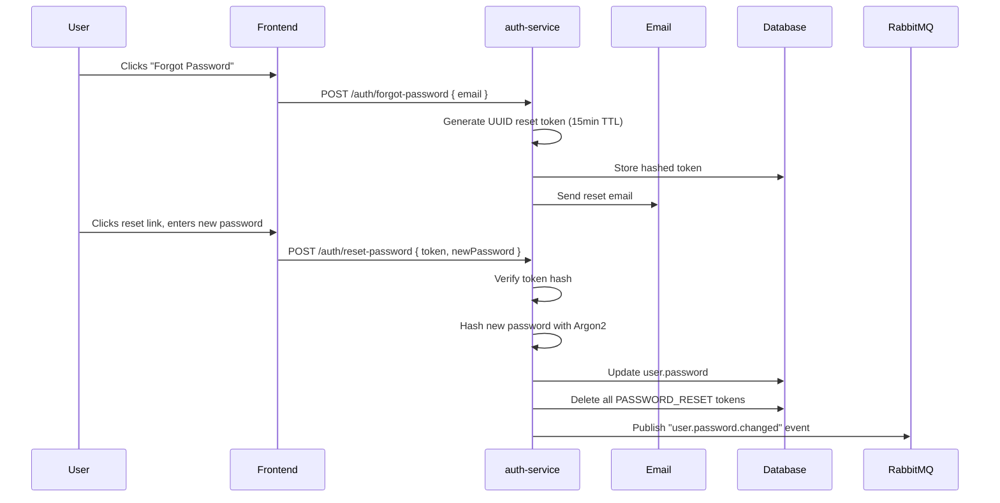

**Key File:** [auth.service.ts](file:///home/mistire/Projects/class-projects/food-delivery-aggregator/auth-service/src/auth/auth.service.ts)

---

## 5. How the Notification Service Handles Events

The `notification-service` is a **hybrid application** that operates as:
1.  An **HTTP server** for REST APIs (fetch notifications, mark as read)
2.  A **NestJS microservice consumer** listening to RabbitMQ
3.  A **WebSocket server** for real-time push notifications

### 5.1 Event Consumption Architecture

```typescript
// notification-service/src/main.ts

// 1. Create HTTP app
const app = await NestFactory.create(AppModule);
app.setGlobalPrefix('notification');

// 2. Connect as RabbitMQ microservice
app.connectMicroservice<MicroserviceOptions>({
  transport: Transport.RMQ,
  options: {
    urls: [process.env.RABBITMQ_URL],
    queue: 'notification_queue',
    queueOptions: { durable: true },
    noAck: true,  // Auto-acknowledge messages
  },
});

// 3. Manually bind queue to topic exchange
const channel = await conn.createChannel();
await channel.assertExchange('auth.events', 'topic', { durable: true });
await channel.assertQueue('notification_queue', { durable: true });
await channel.bindQueue('notification_queue', 'auth.events', 'user.#');

// 4. Start both HTTP and microservice
await app.startAllMicroservices();
await app.listen(4004);
```

### 5.2 Event Routing with @EventPattern

Each consumer uses the `@EventPattern()` decorator to route incoming messages:

```typescript
// notification-service/src/notifications/consumers/auth.consumer.ts

@Controller()
export class AuthConsumer {
  constructor(private readonly notificationsService: NotificationsService) {}

  @EventPattern('user.created')
  async handleUserCreated(@Payload() data: any) {
    const user = data.data;
    await this.notificationsService.createNotification({
      userId: user.userId,
      eventType: 'USER_CREATED',
      message: `Welcome ${user.firstName}! Your account is ready.`,
    });
  }

  @EventPattern('user.email.verified')
  async handleUserEmailVerified(@Payload() data: any) {
    // ... create notification
  }
}
```

### 5.3 Notification Persistence

When a notification is created, it is:
1.  Saved to PostgreSQL (`notify_db`)
2.  Pushed in real-time via WebSocket

```typescript
// notification-service/src/notifications/notifications.service.ts

async createNotification(payload: Partial<Notification>) {
  // 1. Save to database
  const notification = this.repo.create({ ...payload, status: 'SENT' });
  const saved = await this.repo.save(notification);

  // 2. Push via WebSocket
  if (saved.userId) {
    this.gateway.sendNotificationToUser(saved.userId, saved.eventType, saved);
  } else {
    this.gateway.broadcastNotification(saved.eventType, saved);
  }

  return saved;
}
```

**Key Files:**
-   [main.ts](file:///home/mistire/Projects/class-projects/food-delivery-aggregator/notification-service/src/main.ts)
-   [auth.consumer.ts](file:///home/mistire/Projects/class-projects/food-delivery-aggregator/notification-service/src/notifications/consumers/auth.consumer.ts)
-   [order.consumer.ts](file:///home/mistire/Projects/class-projects/food-delivery-aggregator/notification-service/src/notifications/consumers/order.consumer.ts)
-   [notifications.service.ts](file:///home/mistire/Projects/class-projects/food-delivery-aggregator/notification-service/src/notifications/notifications.service.ts)

---

## 6. Why and How Socket.io is Used

### 6.1 Why Use Socket.io?

**Problem**: HTTP is request-response based. The client has to poll the server to get updates.

**Solution**: WebSockets provide a persistent, bidirectional connection. The server can push updates to the client instantly.

| Use Case                     | Without Socket.io          | With Socket.io              |
|------------------------------|----------------------------|-----------------------------|
| Order status changed         | Client polls every 10s     | Server pushes immediately   |
| New order for restaurant     | Owner refreshes manually   | Toast notification appears  |
| Delivery driver picked up    | Customer doesn't know      | Real-time tracking update   |

### 6.2 Socket.io Server (Backend)

The `NotificationsGateway` uses NestJS's WebSocket decorators:

```typescript
// notification-service/src/notifications/notifications.gateway.ts

@WebSocketGateway({
  cors: { origin: '*' },
  namespace: 'notifications',  // Clients connect to /notifications
})
export class NotificationsGateway implements OnGatewayConnection, OnGatewayDisconnect {
  @WebSocketServer()
  server: Server;

  private userSockets: Map<string, string[]> = new Map();  // userId -> socketIds

  handleConnection(client: Socket) {
    const userId = client.handshake.query.userId as string;
    if (userId) {
      client.join(`user_${userId}`);  // Join user-specific room
      this.logger.log(`Client ${client.id} joined room user_${userId}`);
    }
  }

  // Called by NotificationsService when a new notification is created
  sendNotificationToUser(userId: string, eventType: string, payload: any) {
    this.server.to(`user_${userId}`).emit('notification', {
      eventType,
      ...payload,
    });
  }

  broadcastNotification(eventType: string, payload: any) {
    this.server.emit('notification', { eventType, ...payload });
  }
}
```

### 6.3 Socket.io Client (Frontend)

The frontend uses a React Context to manage the socket connection:

```typescript
// frontend/src/context/socket-context.tsx

export function SocketProvider({ children }: { children: React.ReactNode }) {
  const { user } = useAuth();
  const [socket, setSocket] = useState<Socket | null>(null);

  useEffect(() => {
    if (!user) return;

    const socketUrl = process.env.NEXT_PUBLIC_API_URL || 'http://localhost:8080';
    
    const newSocket = io(`${socketUrl}/notifications`, {
      query: { userId: user.id },  // Server uses this to join room
      transports: ['websocket', 'polling'],
    });

    newSocket.on('notification', (data: any) => {
      toast(data.eventType || 'New Notification', {
        description: data.message,
      });
    });

    setSocket(newSocket);
    return () => { newSocket.disconnect(); };
  }, [user]);

  return (
    <SocketContext.Provider value={{ socket, isConnected }}>
      {children}
    </SocketContext.Provider>
  );
}
```

### 6.4 Data Flow: Order Created → Real-time Notification

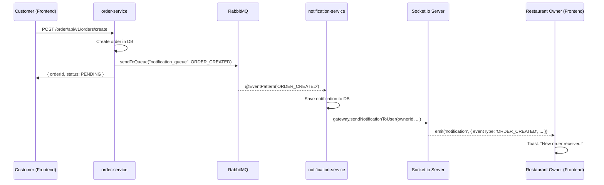

**Key Files:**
-   [notifications.gateway.ts](file:///home/mistire/Projects/class-projects/food-delivery-aggregator/notification-service/src/notifications/notifications.gateway.ts)
-   [socket-context.tsx](file:///home/mistire/Projects/class-projects/food-delivery-aggregator/frontend/src/context/socket-context.tsx)

---

## 7. Why RabbitMQ Queues from Auth-Service Appear Empty

This is a common point of confusion. Understanding the difference between **Topic Exchanges** and **Direct Queues** is key.

### 7.1 The Two Patterns in Use

| Service          | Messaging Pattern | Exchange/Queue          | Visibility in RabbitMQ UI |
|------------------|-------------------|-------------------------|---------------------------|
| `auth-service`   | Topic Exchange    | `auth.events` (exchange)| **No messages shown**     |
| `order-service`  | Direct Queue      | `notification_queue`    | Messages visible          |
| `payment-service`| Direct Queue      | `PAYMENT_EVENTS`        | Messages visible          |

### 7.2 Why Auth Events Don't Show in Queues

```
                                   ┌─────────────────────────────────┐
                                   │         RabbitMQ Broker         │
                                   │                                 │
auth-service ──publish──▶ [auth.events exchange] ──route──▶ [notification_queue] ──▶ notification-service
                             (topic type)                     (bound with user.#)
                             ┌────────────────┐
                             │ NO STORAGE     │
                             │ Just routing   │
                             └────────────────┘
```

**Key Insight**: An exchange is a **router**, not a **storage**. It doesn't hold messages; it forwards them to bound queues.

### 7.3 Why the Queue Looks Empty

| Scenario                              | Result                                                                 |
|---------------------------------------|------------------------------------------------------------------------|
| `notification-service` is **running** | Messages are consumed in milliseconds. They don't linger.              |
| `notification-service` is **stopped** | Messages wait in `notification_queue` (you'll see them in RabbitMQ UI).|
| `noAck: true` is configured           | Consumer auto-acknowledges, so messages disappear upon receipt.        |

### 7.4 How to See Messages (Debugging)

1.  **Stop** `notification-service`:
    ```bash
    docker stop notification-service
    ```
2.  **Trigger an event** (e.g., register a new user).
3.  **Check RabbitMQ UI**: `http://localhost:15672` → Queues → `notification_queue`
4.  You should now see 1+ messages waiting.
5.  **Start** the service again:
    ```bash
    docker start notification-service
    ```

### 7.5 RabbitMQ vs Kafka: Detailed Comparison

#### Feature Comparison Table

| Feature                  | RabbitMQ                           | Kafka                                |
|--------------------------|------------------------------------|--------------------------------------|
| **Architecture Model**   | Message Broker (push-based)        | Distributed Event Log (pull-based)   |
| **Message Persistence**  | Deleted after acknowledgement      | Retained for configurable period     |
| **Consumer Tracking**    | Broker tracks acknowledgements     | Consumer tracks offset               |
| **Visibility After Consume** | Messages disappear             | Messages remain visible in partition |
| **Ordering Guarantee**   | Per-queue FIFO                     | Per-partition FIFO                   |
| **Replay Capability**    | Not possible                       | Replay from any offset            |
| **Routing Flexibility**  | Exchanges, bindings, patterns   | Topic-based only                  |
| **Latency**              | Very low (sub-millisecond)      | Higher (batching optimized)          |
| **Throughput**           | Moderate (10K-50K msg/sec)         | Very High (millions msg/sec)         |
| **Operational Complexity** | Simple to operate             | Requires ZooKeeper/KRaft          |
| **Memory Footprint**     | Lightweight                     | JVM-based, memory-intensive       |
| **Best For**             | Task queues, RPC, routing          | Event sourcing, streaming, analytics |

---

### 7.6 Why RabbitMQ is the Right Choice for This Project

For this **Food Delivery Aggregator**, RabbitMQ provides several key advantages over Kafka:

#### 1. Lower Operational Complexity

```
RabbitMQ: 1 container (rabbitmq:3-management)
Kafka:    3+ containers (kafka broker, zookeeper/kraft, schema-registry)
```

For a class project or startup MVP, RabbitMQ's simplicity is invaluable. You get a **management UI out-of-the-box** at `http://localhost:15672`.

#### 2. Flexible Routing with Exchanges

RabbitMQ's exchange types enable sophisticated routing:

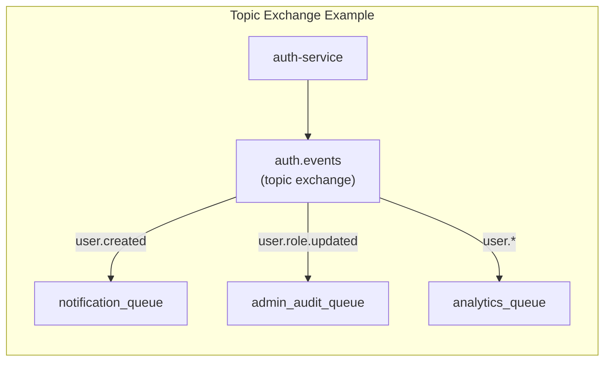

**Kafka doesn't have this.** In Kafka, you'd need separate topics or consumer-side filtering.

#### 3. Request-Reply Pattern (RPC)

RabbitMQ natively supports RPC patterns for synchronous messaging:

```typescript
// Potential future use: Get user details from auth-service
const user = await rabbitMQ.sendAndWait('auth.rpc.get_user', { userId: '123' });
```

Kafka is designed for **fire-and-forget** streaming, not request-reply.

#### 4. Per-Message Acknowledgement

RabbitMQ allows fine-grained control over message acknowledgement:

```typescript
// Manual ack after successful processing
channel.consume('queue', async (msg) => {
  try {
    await processOrder(msg);
    channel.ack(msg);      // Success: remove from queue
  } catch (err) {
    channel.nack(msg, false, true);  // Failure: requeue
  }
});
```

This is perfect for **order processing** where you want messages to retry on failure.

#### 5. Lower Latency for Real-time Notifications

RabbitMQ's push model delivers messages to consumers instantly:

| Scenario                    | RabbitMQ          | Kafka                     |
|-----------------------------|-------------------|---------------------------|
| Order created → notification | **< 5ms**         | 100-500ms (poll interval) |
| Payment success → order update | **< 5ms**       | 100-500ms                 |

For a food delivery app where customers expect **instant status updates**, this matters.

#### 6. Memory Efficiency

RabbitMQ runs efficiently with minimal resources:

| Metric         | RabbitMQ            | Kafka                    |
|----------------|---------------------|---------------------------|
| Base Memory    | ~100-200 MB         | 1-2 GB (JVM heap)         |
| Docker Image   | ~150 MB             | ~500 MB                   |
| CPU Idle       | Minimal             | Constant (log compaction) |

#### When Kafka Would Be Better

Kafka would be the right choice if you needed:
- **Event Replay**: Reprocess all orders from the last month
- **Stream Processing**: Real-time analytics on order trends
- **Massive Scale**: Handling millions of messages per second
- **Event Sourcing**: Rebuilding state from event history

> [!NOTE]
> **Summary**: RabbitMQ is ideal for this project because it provides **low-latency message delivery**, **flexible routing**, **simple operations**, and **reliable message acknowledgement**—all critical for a real-time food delivery system. Kafka's strengths in event streaming and replay aren't needed here.

---

## 8. Database Architecture (Database-per-Service)

Each microservice owns its own database, ensuring loose coupling.

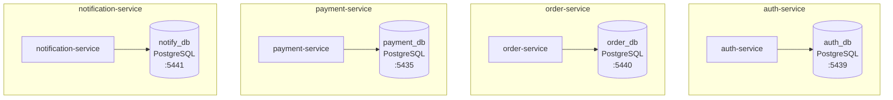

### 8.1 Entity Relationship Diagrams

#### 8.1.1 Auth Database ER Diagram

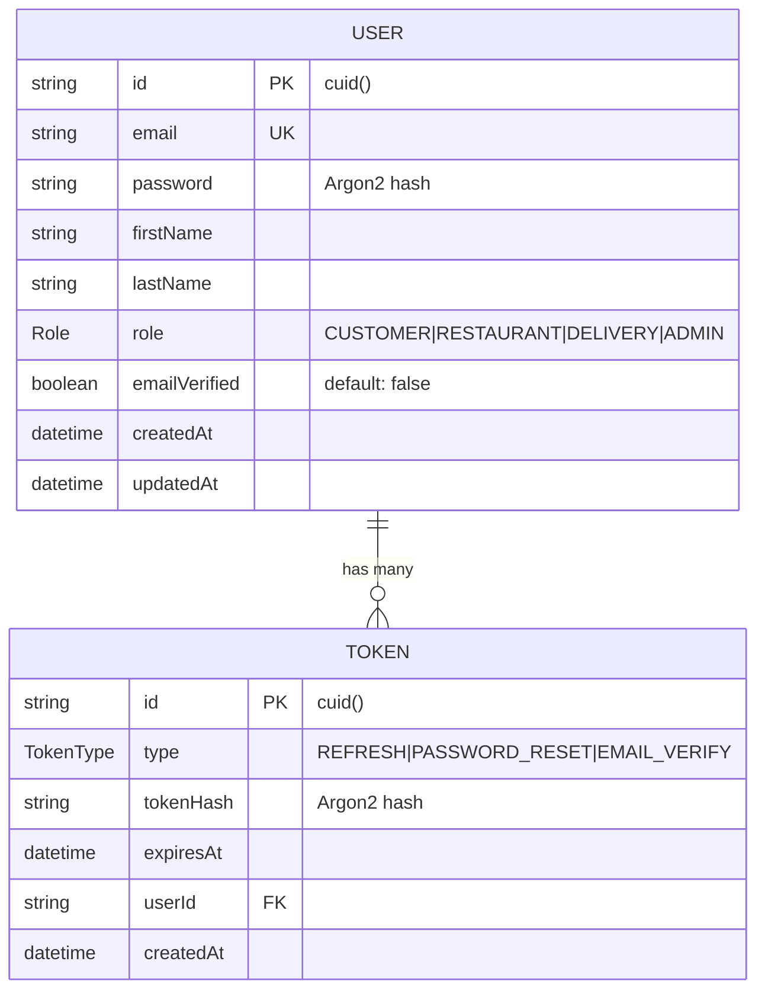

#### 8.1.2 Order Database ER Diagram

```mermaid
erDiagram
    RESTAURANT {
        uuid id PK
        string name UK
        string location
        string ownerId "FK to auth_db.User"
        datetime createdAt
        datetime updatedAt
    }
    
    ITEM {
        uuid id PK
        string name
        string description
        decimal unitPrice "precision: 10,2"
        uuid restaurantId FK
        datetime createdAt
        datetime updatedAt
    }
    
    ORDER {
        uuid id PK
        string userId "FK to auth_db.User"
        uuid restaurantId FK
        string customerName
        string customerEmail
        decimal totalPrice "precision: 10,2"
        OrderStatus status "PENDING|PREPARING|READY|COMPLETED|CANCELLED"
        DeliveryStatus deliveryStatus "PENDING|PICKED_UP|ON_THE_WAY|DELIVERED"
        string driverId "FK to auth_db.User"
        boolean isPaid "default: false"
        string couponCode
        decimal discount
        datetime createdAt
        datetime updatedAt
    }
    
    ORDER_ITEM {
        uuid id PK
        uuid orderId FK
        uuid itemId FK
        int quantity
        decimal price "price at time of order"
    }
    
    REVIEW {
        uuid id PK
        uuid orderId FK UK
        string userId "FK to auth_db.User"
        int rating "1-5"
        string comment
        datetime createdAt
    }
    
    COUPON {
        string code PK
        decimal discount
        boolean isActive "default: true"
        datetime createdAt
    }
    
    RESTAURANT ||--o{ ITEM : "has many"
    RESTAURANT ||--o{ ORDER : "receives"
    ORDER ||--o{ ORDER_ITEM : "contains"
    ITEM ||--o{ ORDER_ITEM : "included in"
    ORDER ||--o| REVIEW : "has one"
```

#### 8.1.3 Payment Database ER Diagram

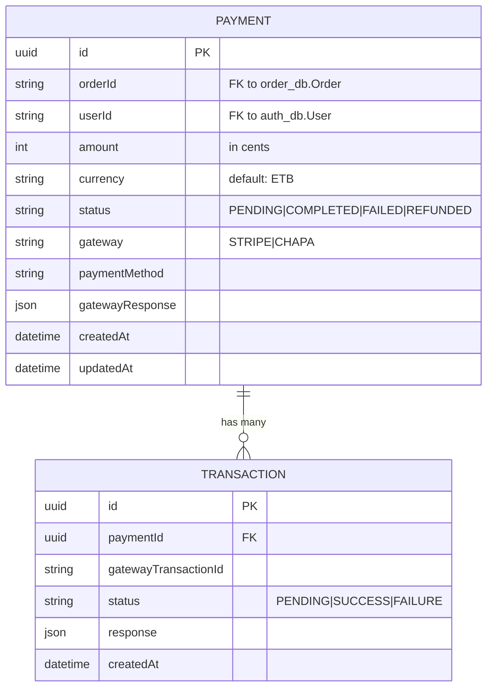

#### 8.1.4 Notification Database ER Diagram

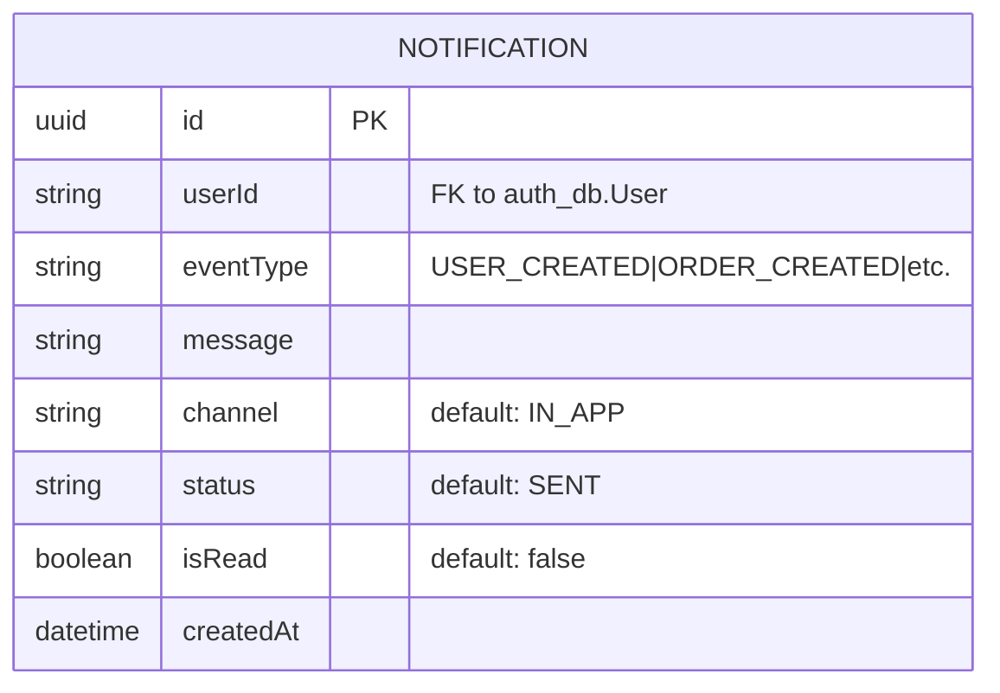

---

### 8.2 Auth Database Schema (Prisma)

```prisma
enum Role {
  CUSTOMER
  RESTAURANT
  DELIVERY
  ADMIN
}

enum TokenType {
  REFRESH
  PASSWORD_RESET
  EMAIL_VERIFY
}

model User {
  id            String   @id @default(cuid())
  email         String   @unique
  password      String   // Argon2 hash
  firstName     String?
  lastName      String?
  role          Role     @default(CUSTOMER)
  emailVerified Boolean  @default(false)
  tokens        Token[]
  createdAt     DateTime @default(now())
  updatedAt     DateTime @updatedAt
}

model Token {
  id        String    @id @default(cuid())
  type      TokenType
  tokenHash String    // Argon2 hash of actual token
  expiresAt DateTime
  userId    String
  user      User      @relation(...)
}
```

**Key Design Decisions:**
-   **Tokens stored as hashes**: Even if DB is compromised, tokens can't be used
-   **Cascade delete**: Deleting a user deletes all their tokens
-   **Role enum**: Type-safe role management

### 8.2 Order Database Schema

```prisma
enum OrderStatus { PENDING, PREPARING, READY, COMPLETED, CANCELLED }
enum DeliveryStatus { PENDING, PICKED_UP, ON_THE_WAY, DELIVERED }

model Restaurant {
  id        String   @id @default(uuid())
  name      String   @unique
  location  String?
  ownerId   String   // References auth_db.User.id
  items     Item[]
  orders    Order[]
}

model Order {
  id             String         @id @default(uuid())
  userId         String         // References auth_db.User.id
  restaurantId   String
  customerName   String?
  customerEmail  String?
  totalPrice     Decimal        @db.Decimal(10, 2)
  status         OrderStatus    @default(PENDING)
  deliveryStatus DeliveryStatus?
  driverId       String?        // References auth_db.User.id
  isPaid         Boolean        @default(false)
  couponCode     String?
  discount       Decimal?
  items          OrderItem[]
  review         Review?
}

model Coupon {
  code      String   @id
  discount  Decimal
  isActive  Boolean  @default(true)
}
```

### 8.3 Payment Database Schema

```prisma
model Payment {
  id               String        @id @default(uuid())
  orderId          String        // References order_db.Order.id
  userId           String        // References auth_db.User.id
  amount           Int           // In cents
  currency         String        @default("ETB")
  status           String        @default("PENDING")
  gateway          String        // "STRIPE" or "CHAPA"
  gatewayResponse  Json?
  transactions     Transaction[]
}

model Transaction {
  id                   String   @id @default(uuid())
  paymentId            String
  gatewayTransactionId String?
  status               String   // PENDING, SUCCESS, FAILURE
  response             Json?
  payment              Payment  @relation(...)
}
```

### 8.4 Notification Database Schema (TypeORM)

```typescript
@Entity('notifications')
export class Notification {
  @PrimaryGeneratedColumn('uuid')
  id: string;

  @Column()
  userId: string;

  @Column()
  eventType: string;  // USER_CREATED, ORDER_CREATED, etc.

  @Column({ nullable: true })
  message: string;

  @Column({ default: 'IN_APP' })
  channel: string;  // IN_APP, EMAIL, SMS

  @Column({ default: 'SENT' })
  status: string;

  @Column({ default: false })
  isRead: boolean;

  @CreateDateColumn()
  createdAt: Date;
}
```

**Key Files:**
-   [auth schema](file:///home/mistire/Projects/class-projects/food-delivery-aggregator/auth-service/prisma/schema.prisma)
-   [order schema](file:///home/mistire/Projects/class-projects/food-delivery-aggregator/order-service/prisma/schema.prisma)
-   [payment schema](file:///home/mistire/Projects/class-projects/food-delivery-aggregator/payment-service/prisma/schema.prisma)
-   [notification entity](file:///home/mistire/Projects/class-projects/food-delivery-aggregator/notification-service/src/notifications/entities/notification.entity.ts)

---

## 9. Security Patterns

### 9.1 Password Hashing with Argon2

**Why Argon2?**
-   Winner of the Password Hashing Competition (2015)
-   Memory-hard: Resistant to GPU/ASIC attacks
-   Configurable time/memory cost

```typescript
// auth-service/src/auth/auth.service.ts

import * as argon from 'argon2';

// Hashing a password
const hash = await argon.hash(dto.password);

// Verifying a password
const isValid = await argon.verify(storedHash, providedPassword);
```

### 9.2 Secure Token Storage

**Problem**: If refresh tokens are stored in plaintext, a database breach exposes all user sessions.

**Solution**: Store tokens as Argon2 hashes.

```typescript
// Creating a token
const token = crypto.randomUUID();
const tokenHash = await argon.hash(token);
await this.prisma.token.create({
  data: { type: 'REFRESH', tokenHash, expiresAt: ..., userId }
});

// Validating a token
const tokens = await this.prisma.token.findMany({ where: { userId, type: 'REFRESH' } });
for (const storedToken of tokens) {
  if (await argon.verify(storedToken.tokenHash, providedToken)) {
    return storedToken;  // Valid!
  }
}
```

### 9.3 JWT Token Structure

```json
{
  "sub": "clx1234567890",     // User ID
  "email": "user@example.com",
  "role": "CUSTOMER",
  "iat": 1705850000,          // Issued at
  "exp": 1705850900           // Expires at (15 min for access token)
}
```

---

## 10. Resilience Patterns

### 10.1 Circuit Breaker (order-service)

The order-service uses the `opossum` library to implement the circuit breaker pattern for external calls:

```javascript
// order-service/src/core/utils/resilience.js

import CircuitBreaker from 'opossum';

const options = {
  timeout: 3000,                    // Fail if call takes > 3s
  errorThresholdPercentage: 50,     // Open circuit if 50% fail
  resetTimeout: 30000               // Try again after 30s
};

export function createBreaker(action) {
  const breaker = new CircuitBreaker(action, options);
  
  breaker.on('open', () => console.log('Circuit breaker OPENED'));
  breaker.on('halfOpen', () => console.log('Circuit breaker HALF_OPENED'));
  breaker.on('close', () => console.log('Circuit breaker CLOSED'));
  
  return breaker;
}
```

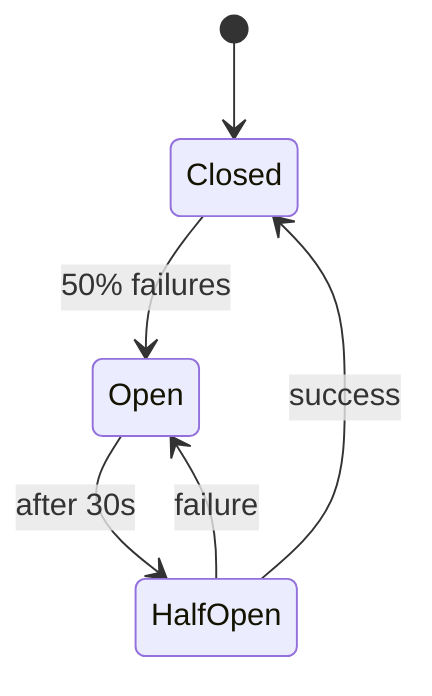

### 10.2 Why Opossum is Only in Order-Service (Not Other Services)

> [!IMPORTANT]
> This is a **deliberate architectural decision**, not an oversight.

#### The Key Question: Which services make external/unreliable calls?

| Service              | External Dependencies                      | Needs Circuit Breaker? |
|----------------------|--------------------------------------------|------------------------|
| **order-service**    | Payment gateway (simulated)             | **Yes**                |
| **order-service**    | RabbitMQ (for notifications)            | Handled differently    |
| **auth-service**     | Only local DB + RabbitMQ                | No                     |
| **payment-service**  | Stripe/Chapa APIs                       | Should have, but...    |
| **notification-service** | Only local DB + Socket.io          | No                     |

#### Why Order-Service Has It

In `order-service`, there's a **simulated external payment gateway call**:

```javascript
// order-service/src/core/services/order.service.js

// Simulated external payment gateway call
const callExternalPaymentGateway = async (orderData) => {
  console.log(`Calling external payment gateway for Order ${orderData.id}...`);
  // In production: axios call to Stripe/PayPal
  return { success: true, transactionId: `TXN_${...}` };
};

const paymentBreaker = createBreaker(callExternalPaymentGateway);
```

**Why this needs protection:**
- External payment APIs can be slow, timeout, or rate-limit you
- If the payment gateway is down, you don't want to keep retrying and exhausting resources
- The circuit breaker "fails fast" after repeated failures

#### Why Auth-Service Doesn't Need It

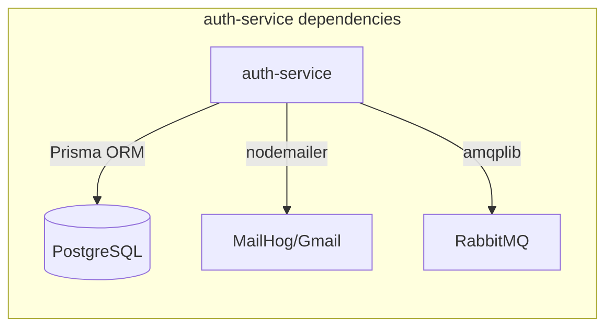

| Dependency   | Reliability     | How It's Handled                           |
|--------------|-----------------|---------------------------------------------|
| PostgreSQL   | Very high       | Connection pooling + Prisma retry logic    |
| MailHog      | Local container | Graceful failure (user still registered)   |
| RabbitMQ     | High            | Retry loop + graceful degradation (see 10.3)|

Auth operations are **fast and local**. There's no third-party API that could cause cascading failures.

#### Why Payment-Service Doesn't Have It (But Probably Should)

The `payment-service` calls **real external APIs** (Stripe, Chapa), which are prime candidates for circuit breakers:

```javascript
// payment-service/src/services/stripeService.js
const stripe = new Stripe(config.STRIPE_SECRET_KEY);

const createPaymentIntent = async (amount, currency, metadata) => {
  return stripe.paymentIntents.create({ amount, currency, metadata });
};
```

**Why it's currently missing:**
1. **Stripe SDK has built-in retry logic** - Stripe's official library handles transient failures
2. **Webhook-based architecture** - Payment results come via webhooks, not synchronous calls
3. **Simplicity for MVP** - Adding opossum everywhere adds complexity

> [!TIP]
> **Recommendation**: For production, add a circuit breaker around Stripe/Chapa calls to prevent cascade failures during payment gateway outages.

#### Why Notification-Service Doesn't Need It

The notification-service only:
- Writes to its **local PostgreSQL**
- Pushes to **Socket.io** (in-process, no external call)
- Consumes from **RabbitMQ** (broker handles reliability)

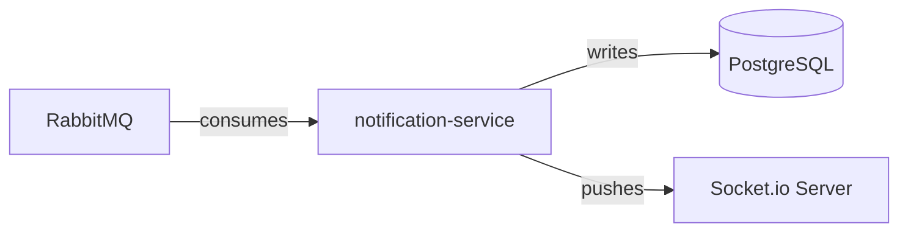

There are **no external HTTP calls** to protect.

#### Summary: When to Use Circuit Breakers

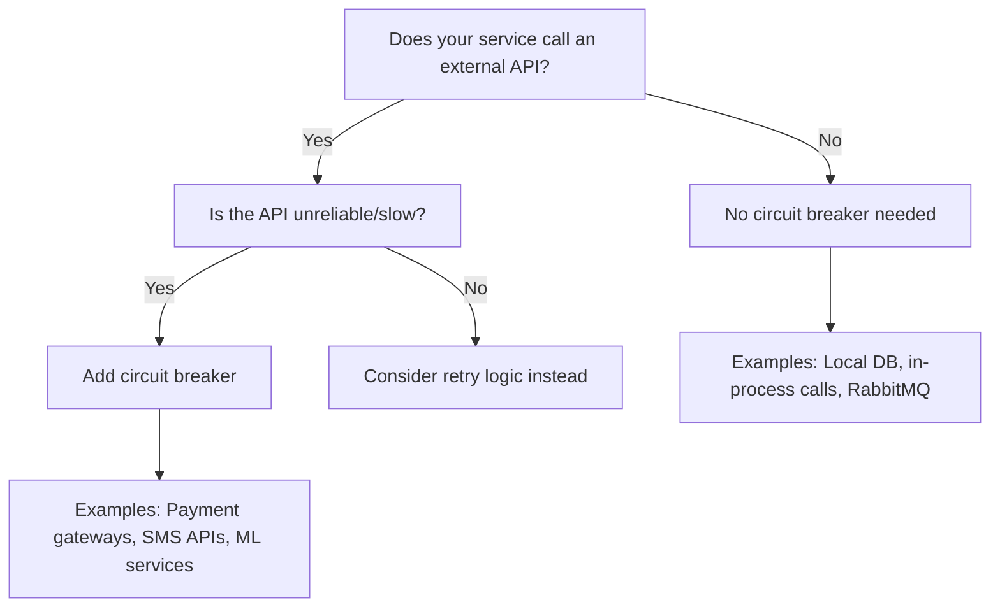

---

### 10.3 RabbitMQ Connection Retry

```typescript
// auth-service/src/rabbitmq/rabbitmq.service.ts

private async connect() {
  for (let attempt = 1; attempt <= 10; attempt++) {
    try {
      this.connection = await amqp.connect(rabbitmqUrl);
      this.channel = await this.connection.createConfirmChannel();
      return;  // Success!
    } catch (error) {
      this.logger.warn(`Attempt ${attempt} failed. Retrying in 2s...`);
      await new Promise(r => setTimeout(r, 2000));
    }
  }
  this.logger.error('RabbitMQ connection failed. Running without events.');
}
```

### 10.4 Graceful Degradation

If RabbitMQ is unavailable, the auth-service continues to work:

```typescript
async onModuleInit() {
  await this.connect().catch((error) => {
    this.logger.warn('RabbitMQ unavailable. Events will not be published.');
  });
}

async publish(routingKey: string, message: any): Promise<boolean> {
  if (!this.channel) {
    this.logger.debug(`Event '${routingKey}' not published - no channel.`);
    return false;  // Silently fail
  }
  // ... publish logic
}
```

### 10.5 Resilience Pattern Comparison

| Pattern                | Implementation                  | Purpose                                    |
|------------------------|---------------------------------|--------------------------------------------|
| **Circuit Breaker**    | opossum in order-service        | Fail fast on external service failures     |
| **Retry with Backoff** | RabbitMQ connection in auth     | Handle transient failures during startup   |
| **Graceful Degradation**| RabbitMQ publish in auth       | Continue core operations if optional features fail |
| **Timeout**            | opossum 3s timeout              | Prevent hanging on slow external calls     |
| **Bulkhead** *(not implemented)* | -                     | Isolate failures to prevent cascade        |

## 11. Frontend API Client with Transparent Token Refresh

The frontend uses a custom `ApiClient` class that automatically refreshes expired access tokens:

```typescript
// frontend/src/lib/api.ts

async fetch<T>(endpoint: string, options: RequestInit = {}, isRetry = false): Promise<T> {
  const token = localStorage.getItem('token');
  const refreshToken = localStorage.getItem('refreshToken');

  const response = await fetch(url, {
    headers: { Authorization: `Bearer ${token}` },
    ...options,
  });

  // If 401 and we have a refresh token, try to refresh
  if (response.status === 401 && !isRetry && refreshToken) {
    try {
      const refreshResponse = await fetch('/auth/refresh-token', {
        method: 'POST',
        body: JSON.stringify({ refreshToken })
      });

      if (refreshResponse.ok) {
        const tokens = await refreshResponse.json();
        localStorage.setItem('token', tokens.access_token);
        localStorage.setItem('refreshToken', tokens.refresh_token);
        
        // Retry the original request with new token
        return this.fetch<T>(endpoint, options, true);
      }
    } catch (err) {
      // Refresh failed, logout user
      localStorage.clear();
      window.location.href = '/login';
    }
  }

  return response.json();
}
```

**Flow:**
1.  Request made with access token
2.  If 401, use refresh token to get new tokens
3.  Retry original request
4.  If refresh fails, logout user

---

## 12. Infrastructure Overview

### 12.1 Docker Compose Services

```yaml
services:
  # Infrastructure
  rabbitmq:     # :5672 (AMQP), :15672 (Management UI)
  redis:        # :6379 (used by payment-service)
  mailhog:      # :1025 (SMTP), :8025 (Web UI)

  # Databases
  auth-db:      # PostgreSQL :5439
  order-db:     # PostgreSQL :5440
  payment-db:   # PostgreSQL :5435
  db-notif:     # PostgreSQL :5441

  # Microservices
  auth-service:         # :4000
  order-service:        # :4002
  payment-service:      # :4003
  notification-service: # :4004

  # API Layer
  api-gateway:  # :4001 (Swagger aggregation)
  api-nginx:    # :8080 (Reverse proxy)

  # Frontend
  frontend:     # :3000
```

### 12.2 Network Topology

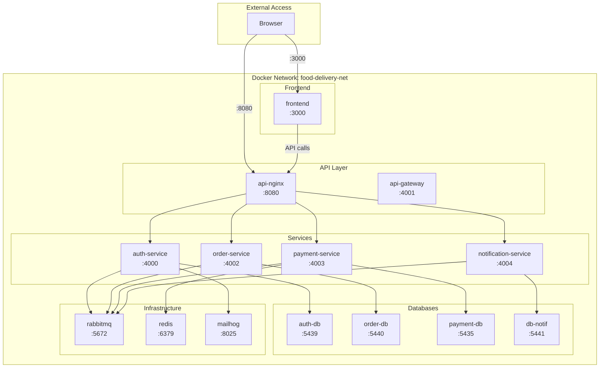

**Key File:** [docker-compose.yml](file:///home/mistire/Projects/class-projects/food-delivery-aggregator/infrastructure/docker-compose.yml)

---

## 13. Complete Message Flow Diagrams

### 13.1 User Registration → Welcome Notification

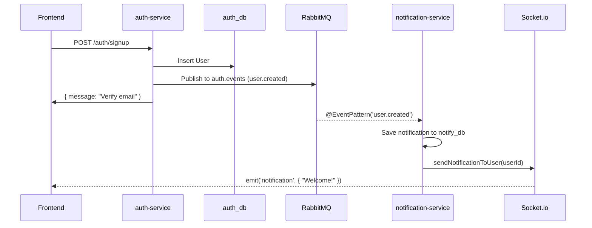

### 13.2 Order → Payment → Real-time Update

```mermaid
sequenceDiagram
    participant Customer
    participant ORDER as order-service
    participant PAY as payment-service
    participant RMQ as RabbitMQ
    participant NOTIF as notification-service
    participant WS as Socket.io
    participant Restaurant

    Customer->>ORDER: Create Order
    ORDER->>ORDER: Save order (isPaid: false)
    ORDER->>RMQ: notification_queue (ORDER_CREATED)
    ORDER->>Customer: { orderId, paymentUrl }

    RMQ-->>NOTIF: ORDER_CREATED
    NOTIF->>WS: Notify restaurant owner
    WS-->>Restaurant: "New order!"

    Customer->>PAY: Pay for order
    PAY->>PAY: Process payment
    PAY->>RMQ: PAYMENT_EVENTS (PAYMENT_SUCCESS)

    RMQ-->>ORDER: PAYMENT_SUCCESS
    ORDER->>ORDER: Update order (isPaid: true, status: PREPARING)
    ORDER->>RMQ: notification_queue (ORDER_STATUS_UPDATED)

    RMQ-->>NOTIF: ORDER_STATUS_UPDATED
    NOTIF->>WS: Notify customer + restaurant
    WS-->>Customer: "Order is being prepared!"
    WS-->>Restaurant: "Order paid, start cooking!"
```

---

This comprehensive document covers all major technical aspects of the Food Delivery Aggregator architecture. For any specific deep-dive, refer to the linked source files.

